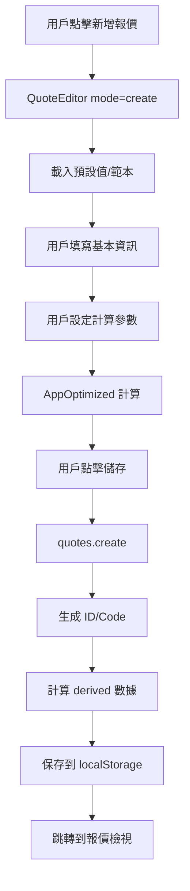
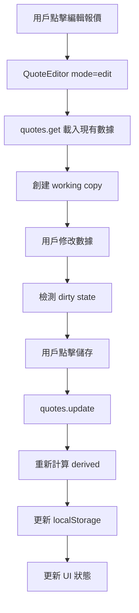
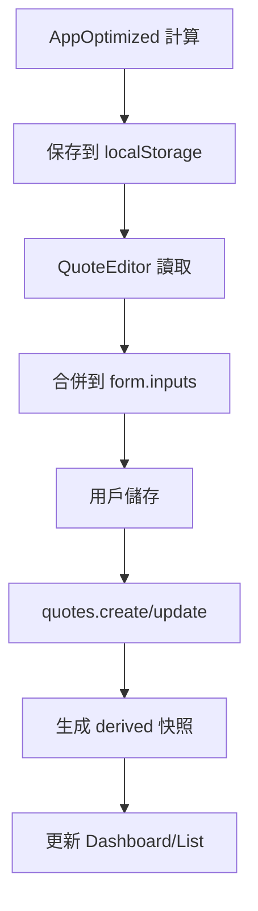

# Incoterm 報價系統 - 數據結構文檔

## 📋 目錄
- [核心數據模型](#核心數據模型)
- [存儲架構](#存儲架構)
- [Repository 模式](#repository-模式)
- [數據流程](#數據流程)
- [API 接口設計](#api-接口設計)

---

## 🏗️ 核心數據模型

### 1. Quote (報價單) - 主要實體

```typescript
interface Quote {
  // 基礎識別
  id: string;                    // UUID v4
  code: string;                  // 報價單號 (Q2025-0001)
  status: 'draft' | 'sent' | 'won' | 'lost' | 'void';
  
  // 時間戳
  createdAt: string;             // ISO 8601
  updatedAt: string;             // ISO 8601
  
  // 數據分層
  meta: QuoteMeta;               // 客戶/單據元數據
  inputs: QuoteInputs;           // 計算參數 (唯一來源)
  derived: QuoteDerived;         // 計算結果快照
}
```

### 2. QuoteMeta (客戶/單據元數據)

```typescript
interface QuoteMeta {
  // 客戶信息
  customerName: string;          // 客戶名稱 (必填)
  contactInfo?: string;          // 聯絡方式
  customerId?: string;           // 客戶ID (未來擴展)
  
  // 單據信息
  paymentTerms?: string;         // 付款條件
  validUntil?: string;           // 有效期 (ISO 8601)
  notes?: string;                // 備註
  
  // 業務信息 (不參與計算)
  salesperson?: string;          // 業務員
  projectName?: string;          // 專案名稱
  reference?: string;            // 參考號
}
```

### 3. QuoteInputs (計算參數 - 唯一來源)

```typescript
interface QuoteInputs {
  // 貿易條件
  incotermFrom: 'EXW' | 'FOB' | 'CFR' | 'CIF' | 'DAP' | 'DDP';
  incotermTo: 'EXW' | 'FOB' | 'CFR' | 'CIF' | 'DAP' | 'DDP';
  
  // 定價設定
  markupMode: 'markup' | 'margin';  // 加價模式
  markupPct: number;                 // 加價率 (%)
  currency: 'JPY' | 'USD' | 'TWD';  // 貨幣
  
  // 商品列表
  products: Product[];
  
  // 成本參數
  costs: CostParameters;
  
  // 物流設定
  logistics: LogisticsConfig;
}
```

### 4. Product (商品)

```typescript
interface Product {
  id: string;                    // UUID v4
  name: string;                  // 商品名稱
  description?: string;          // 商品描述
  
  // 規格參數
  length: number;                // 長度 (mm)
  width: number;                 // 寬度 (mm)
  height: number;                // 高度 (mm)
  weight: number;                // 重量 (kg)
  
  // 計算模式
  inputMode: 'perBox' | 'perUnit';  // 單箱模式 | 單個模式
  
  // 價格設定
  supplierUnitPrice: number;     // 供應商單價
  units: number;                 // 數量
  
  // 物流係數
  transportMode: 'volume' | 'weight' | 'custom';
  customDivisor?: number;        // 自定義除數
  
  // 計算結果 (派生)
  cbm?: number;                  // 體積 (m³)
  chargeableWeight?: number;     // 計費重量 (kg)
  logisticsFactor?: number;      // 物流係數
}
```

### 5. CostParameters (成本參數)

```typescript
interface CostParameters {
  // 整票費用
  totalFreight: number;          // 總運費
  totalInsurance: number;        // 總保險費
  totalDocumentation: number;    // 總文件費
  totalPortCharges: number;      // 總港雜費
  totalOther: number;            // 其他費用
  
  // 單個費用 (可選)
  perUnitFreight?: number;       // 單個運費
  perUnitInsurance?: number;     // 單個保險費
  perUnitDocumentation?: number; // 單個文件費
  perUnitPortCharges?: number;   // 單個港雜費
  perUnitOther?: number;         // 單個其他費用
  
  // 計算模式
  costMode: 'total' | 'perUnit'; // 整票總額 | 單個模式
}
```

### 6. LogisticsConfig (物流設定)

```typescript
interface LogisticsConfig {
  // 運輸方式
  transportMode: 'air' | 'sea' | 'land';
  
  // 包裝設定
  packagingType: 'standard' | 'custom';
  packagingWeight?: number;      // 包裝重量 (kg)
  
  // 特殊要求
  specialRequirements?: string;
  handlingInstructions?: string;
}
```

### 7. QuoteDerived (計算結果快照)

```typescript
interface QuoteDerived {
  // 商品計算結果
  items: QuoteItem[];
  
  // 總計
  totals: QuoteTotals;
  
  // 成本分解
  costBreakdown: CostBreakdown;
  
  // 利潤分析
  profitAnalysis: ProfitAnalysis;
}
```

### 8. QuoteItem (商品計算結果)

```typescript
interface QuoteItem {
  productId: string;             // 商品ID
  name: string;                  // 商品名稱
  
  // 基礎數據
  units: number;                 // 數量
  supplierUnitPrice: number;     // 供應商單價
  
  // 計算結果
  unitCost: number;              // 單位成本
  unitQuote: number;             // 單位報價
  totalCost: number;             // 總成本
  totalQuote: number;            // 總報價
  
  // 利潤
  unitProfit: number;            // 單位利潤
  totalProfit: number;           // 總利潤
  marginPct: number;             // 毛利率 (%)
}
```

### 9. QuoteTotals (總計)

```typescript
interface QuoteTotals {
  // 數量統計
  totalUnits: number;            // 總數量
  
  // 金額統計
  totalGoodsValue: number;       // 商品總值
  totalExportCosts: number;      // 出口費用總計
  shipmentCostInclGoods: number; // 含商品運費
  totalQuote: number;            // 總報價
  
  // 利潤統計
  totalProfit: number;           // 總利潤
  avgMarginPct: number;          // 平均毛利率 (%)
}
```

### 10. CostBreakdown (成本分解)

```typescript
interface CostBreakdown {
  freight: number;               // 運費
  insurance: number;             // 保險費
  documentation: number;         // 文件費
  portCharges: number;           // 港雜費
  other: number;                 // 其他費用
  
  // 占比分析
  freightPct: number;            // 運費占比 (%)
  insurancePct: number;          // 保險費占比 (%)
  documentationPct: number;      // 文件費占比 (%)
  portChargesPct: number;        // 港雜費占比 (%)
  otherPct: number;              // 其他費用占比 (%)
}
```

### 11. ProfitAnalysis (利潤分析)

```typescript
interface ProfitAnalysis {
  // 利潤指標
  totalProfit: number;           // 總利潤
  avgMarginPct: number;          // 平均毛利率
  profitPerUnit: number;         // 單位利潤
  
  // 成本結構
  costRatio: number;             // 成本比率
  markupRatio: number;           // 加價比率
  
  // 風險指標
  breakEvenPoint: number;        // 損益平衡點
  profitMargin: number;          // 利潤邊際
}
```

---

## 💾 存儲架構

### 1. 本地存儲 (localStorage)

```typescript
// 存儲鍵值
const STORAGE_KEYS = {
  QUOTES: 'incoterm-quotes',           // 報價單列表
  SEQUENCE: 'incoterm-quote-sequence', // 序號計數器
  PREFERENCES: 'incoterm-preferences', // 用戶偏好
  CALCULATOR_INPUTS: 'incoterm-inputs' // 計算器輸入 (臨時)
};

// 數據結構
interface StoredData {
  quotes: Quote[];                     // 報價單數組
  sequence: number;                    // 當前序號
  preferences: UserPreferences;        // 用戶偏好
  calculatorInputs: CalculatorInputs;  // 計算器狀態
}
```

### 2. 數據持久化策略

```typescript
// 自動保存觸發條件
const AUTO_SAVE_TRIGGERS = [
  'productQuotes 變化',
  'inputs 變化',
  'costParameters 變化',
  'logisticsConfig 變化'
];

// 數據版本控制
interface DataVersion {
  schemaVersion: string;               // 數據結構版本
  appVersion: string;                  // 應用版本
  lastUpdated: string;                 // 最後更新時間
}
```

---

## 🔄 Repository 模式

### 1. QuoteRepo 接口

```typescript
interface QuoteRepo {
  // 基礎 CRUD
  list(): Promise<Quote[]>;
  get(id: string): Promise<Quote | undefined>;
  create(input: CreateQuoteInput): Promise<Quote>;
  update(id: string, patch: UpdateQuoteInput): Promise<Quote>;
  remove(id: string): Promise<void>;
  
  // 業務操作
  duplicate(id: string): Promise<Quote>;
  exportToJson(): Promise<string>;
  importFromJson(json: string): Promise<void>;
  
  // 統計分析
  getStats(): Promise<DashboardStats>;
  getTrendData(): Promise<TrendData[]>;
  getCostShareData(): Promise<CostShareData[]>;
  getRecentQuotes(limit?: number): Promise<Quote[]>;
  
  // 工具方法
  getNextQuoteCode(): Promise<string>;
}
```

### 2. LocalQuoteRepo 實現

```typescript
class LocalQuoteRepo implements QuoteRepo {
  private storageKey = 'incoterm-quotes';
  private sequenceKey = 'incoterm-quote-sequence';
  
  // 使用 localStorage 作為存儲後端
  // 支持完整的 CRUD 操作
  // 包含數據驗證和錯誤處理
}
```

### 3. 依賴注入 (Context)

```typescript
// RepoProvider.tsx
const RepoCtx = React.createContext<{
  quotes: QuoteRepo;
} | null>(null);

export const RepoProvider: React.FC<{children: React.ReactNode}> = ({children}) => {
  const quotes = useMemo(() => new LocalQuoteRepo(), []);
  return <RepoCtx.Provider value={{quotes}}>{children}</RepoCtx.Provider>;
};

export const useQuotes = () => {
  const ctx = useContext(RepoCtx);
  if (!ctx) throw new Error("RepoProvider missing");
  return ctx.quotes;
};
```

---

## 📊 數據流程

### 1. 創建報價流程



### 2. 編輯報價流程



### 3. 數據同步流程



---

## 🔌 API 接口設計 (未來擴展)

### 1. RESTful API 設計

```typescript
// 報價單管理
GET    /api/quotes              // 獲取報價單列表
POST   /api/quotes              // 創建新報價單
GET    /api/quotes/:id          // 獲取特定報價單
PUT    /api/quotes/:id          // 更新報價單
DELETE /api/quotes/:id          // 刪除報價單
POST   /api/quotes/:id/duplicate // 複製報價單

// 統計分析
GET    /api/dashboard/stats     // 獲取儀表板統計
GET    /api/dashboard/trends    // 獲取趨勢數據
GET    /api/dashboard/cost-share // 獲取成本占比

// 數據管理
POST   /api/import              // 導入數據
GET    /api/export              // 導出數據
```

### 2. 數據傳輸格式

```typescript
// 請求格式
interface CreateQuoteRequest {
  meta: QuoteMeta;
  inputs: QuoteInputs;
}

// 響應格式
interface QuoteResponse {
  success: boolean;
  data?: Quote;
  error?: string;
  message?: string;
}

// 列表響應
interface QuoteListResponse {
  success: boolean;
  data: {
    quotes: Quote[];
    total: number;
    page: number;
    limit: number;
  };
}
```

---

## 🎯 關鍵設計原則

### 1. 單一事實來源
- **計算參數**: `quote.inputs` 是唯一來源
- **顯示數據**: 優先使用 `quote.derived` 快照
- **元數據**: `quote.meta` 不參與計算

### 2. 數據分層
- **Meta**: 客戶/單據信息 (不影響計算)
- **Inputs**: 計算參數 (唯一來源)
- **Derived**: 計算結果 (快照)

### 3. 版本控制
- 支持數據結構升級
- 向後兼容性
- 遷移策略

### 4. 錯誤處理
- 數據驗證
- 類型安全
- 優雅降級

---

## 📝 使用範例

### 1. 創建新報價

```typescript
const newQuote = await quotes.create({
  meta: {
    customerName: "ABC 貿易公司",
    contactInfo: "contact@abc.com",
    paymentTerms: "T/T 30 days"
  },
  inputs: {
    incotermFrom: "EXW",
    incotermTo: "CIF",
    markupMode: "margin",
    markupPct: 15,
    currency: "USD",
    products: [...],
    costs: {...},
    logistics: {...}
  }
});
```

### 2. 更新報價

```typescript
const updatedQuote = await quotes.update(quoteId, {
  meta: {
    customerName: "更新後的客戶名稱"
  },
  inputs: {
    markupPct: 20  // 修改加價率
  }
});
```

### 3. 獲取統計數據

```typescript
const stats = await quotes.getStats();
// 返回: { totalQuotes, avgMargin, totalValue, openQuotes }

const trends = await quotes.getTrendData();
// 返回: [{ date, count, totalQuote }]

const costShare = await quotes.getCostShareData();
// 返回: [{ label, value, percentage }]
```

---

*此文檔記錄了 Incoterm 報價系統的完整數據結構和存儲架構，為未來的開發和維護提供參考。*
